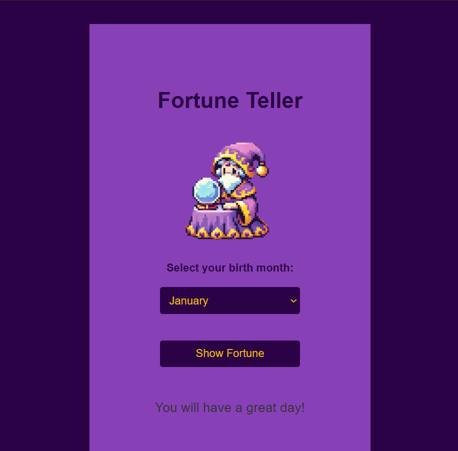

# Fortune Teller

This is a simple web application that allows users to select their birth month and receive a random fortune based on their horoscope.

## Screenshot

## Project Structure

- `index.html`: The main HTML file that contains the structure of the web page.
- `index.css`: The CSS file that contains the styles for the web page.
- `index.js`: The JavaScript file that contains the logic for displaying the fortune.

## How to Use

1. Open `index.html` in a web browser.
2. Select your birth month from the dropdown menu.
3. Click the "Show Fortune" button to see your fortune.
